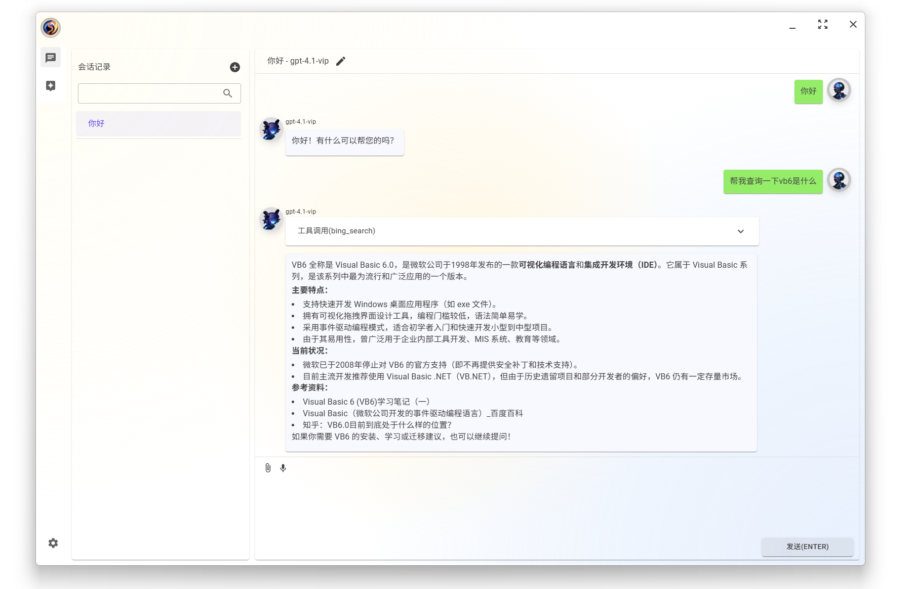
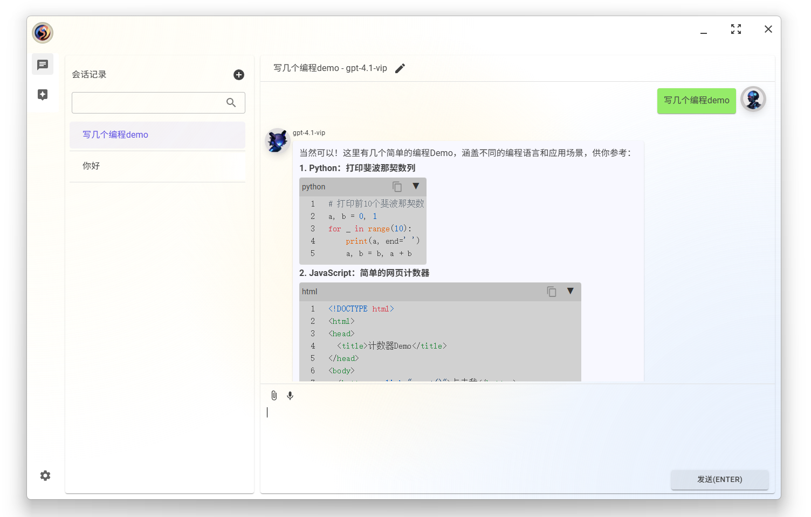

# Tinvo

**A powerful, cross-platform, and open-source LLM AI client built with Blazor.**

## Overview

Tinvo is designed to be a comprehensive and extensible client for various AI models, supporting both cloud-based APIs and local inference engines. Its cross-platform nature, powered by Blazor, allows you to run it on your favorite devices, from desktops to mobile phones, and even in your web browser.

## Features
- **Multi-Provider Support:**  
  - [OpenAI](https://openai.com/)
  - [iFlytek (Xunfei)](https://www.xfyun.cn/)
  - [ONNX](https://onnx.ai/)
  - [Ollama](https://ollama.com/)
  - [Llama Models](https://llama.meta.com/)
  - Model Context Protocol (MCP) Tools Call

- **Cross-Platform Compatibility:**  
  - Android
  - iOS
  - Windows
  - MacOS
  - Linux
  - Web Server
  - WebAssembly (WASM)
  
## Screenshots

## License

This project is licensed under the MIT License